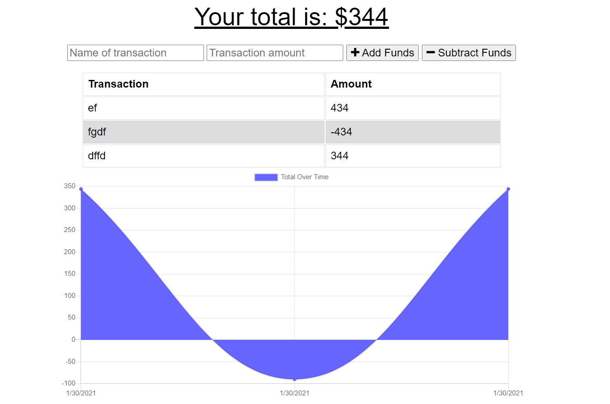

# Budget Tracker
This program is a budget tracker that works with both online and offline mode.

    
* [Installation](#Installation)
    
* [Instructions](#Instructions)

* [Deployed Link](#Deployed-Link)
    
* [License](#License)
       
    ## Installation
    Make sure that you have Nodejs, Mongodb, and a tool like Robo 3T already installed and run a localhost server with the command: "node server.js".
    ## Instructions
    Enter the name of a transaction and an amount and click the button to add or subtract the amount.
    ## Deployed Link
    https://budget-tracker-holzer.herokuapp.com/ 

    ## License 
    This project is licensed under the MIT license
    - Email: timiholzer@gmail.com - GitHub Repo: https://github.com/timholzer/offline-mode-budget-pwa